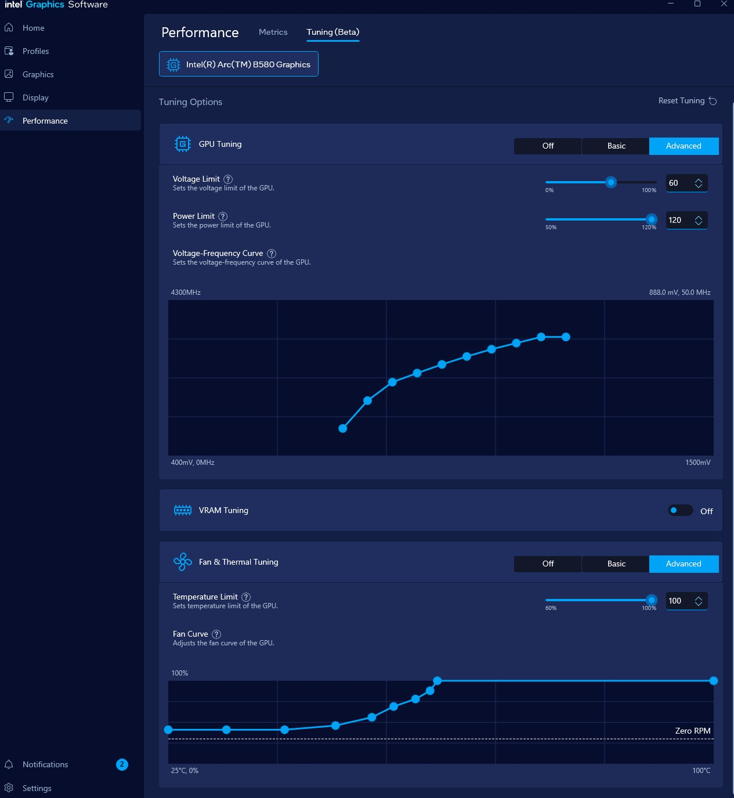
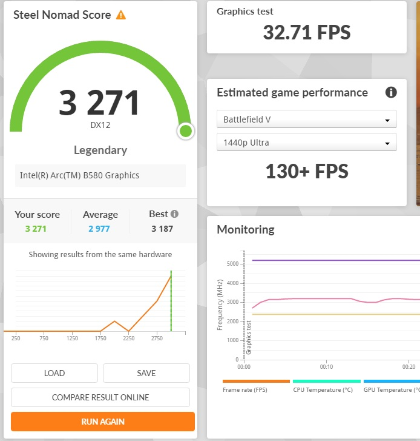

# Welcome to my XPU Notes

This will serve and my notes for setting up and running XPU related projects within PyTorch, Tensorflow, StableDiffusion etc...

I am currently testing with:

- ASRock Challenger ARC A380 6GB
- Acer Predator BiFrost ARC A770 16GB
- Intel ARC B580 Limited Edition 12GB

I am very impressed so far with the Battlemage mixed precision performance. In my benchmarks I am seeing a single B580's performance around an RTX 2080 Ti or Nvidia L4 in Google Colab training a BERT model.

If you are running an ARC GPU in tandem with your iGPU you may run into issues until you disable the iGPU or happen to be running on a MB without iGPU support.

I am far from an expert or engineer, but I do enjoy learning every day.

**Note:** If you want an easy 400mhz overclock on an ARC B580 without crashes (so far) dont adjust the frequency. 

- Set your power level to 120% or more
- Set your voltage limit to +60%
  - This will allow the gpu to clock up to 3200mhz using the stock voltage/freq curve
- Set a more aggressive fan curve to handle the small increase in heat
- Wattage will go from 105-120w under load to 140-150w
  - The minimal cooler for a B580 is designed for a peak of 220w
  - Voltage will increase about 0.050-0.075v

My settings:

Due to ARC drivers not being recognized I have been denied my world record benchmark...much sadness

## Links to instructions
* <a href="Native-Windows-Intel-ARC-XPU-Torch-With Mixed-Precision.md">Native Windows Intel ARC XPU Torch With Mixed Precision</a>
* <a href="Examples/readme.md">Example code with XPU, Mixed Precision, Etc...</a>